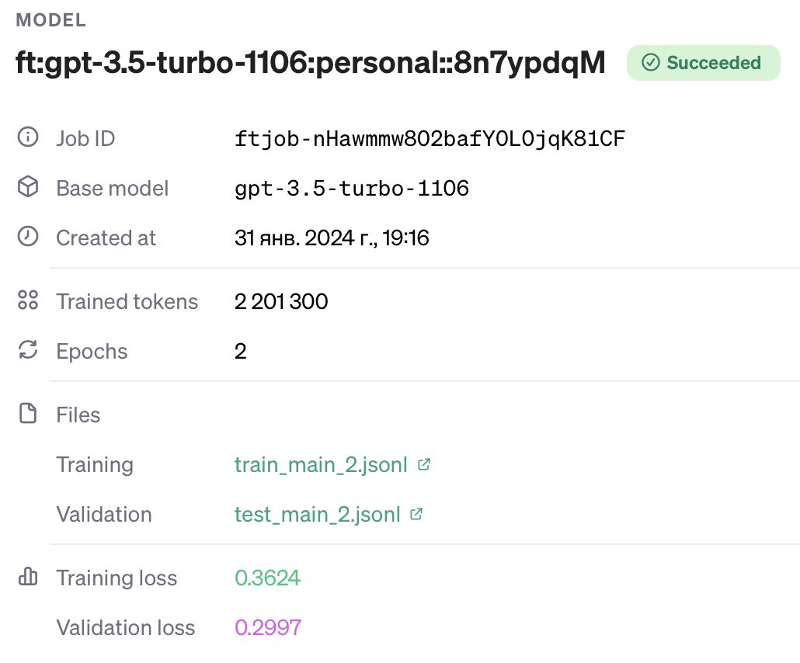

# `PetKaz` at SemEval-2024 Task 3: Advancing Emotion Classification with an LLM for Emotion-Cause Pair Extraction in Conversations

This repository provides the code necessary to replicate the paper [*PetKaz at SemEval-2024 Task 3: Advancing Emotion Classification with an LLM for Emotion-Cause Pair Extraction in Conversations*](https://arxiv.org/abs/2404.05502) from SemEval-2024.

Our pipeline has two parts: 1) (non-)emotional utterances classification with fine-tuned `gpt-3.5-turbo-1106`; 2) cause extraction with a simple `CauseExtractor` neural network.

First, please install dependencies:
```
pip install -r requirements.txt
```

**Note**: itilially we divided an original training data (`data/Subtask_1_train.json`) into `data/Subtask_1_train_real.json` and `data/Subtask_1_dev.json` for our needs.

## Emotion classification
If you want to fine-tune an emotion classifier based on `gpt-3.5-turbo-1106`, you need to go through the following steps.

1) Prepare data, run:
    ```
    python src/data4finetuning.py
    ```
    This will create files `data/train_main_2.jsonl` and `data/test_main_2.jsonl` obtained from `data/Subtask_1_train_real.json` and `data/Subtask_1_dev.json` respectively. They contain prompts and responses. The prompt template is in `data/prompt_main.txt`. We use the target utterance and the previous one as a context for classification. Note that we used the whole dataset but reduced the number of `neutral` utterances to balance it.

2) Fine-tune the `gpt-3.5-turbo-1106` model using the [OpenAI fine-tuning UI](https://platform.openai.com/finetune). Please refer to their [documentation](https://platform.openai.com/docs/guides/fine-tuning).

Here is our model:


Unfortunately, we cannot share our model due to the OpenAI policy.

To use the model, you should run:
```
python src/emotion_annotation.py
```
This will annotate utterances from `data/Subtask_1_test.json` and save them to `data/Subtask_1_test_gpt.json`. **Do not forget to specify `api_key` and `model` (in `get_completion`).**

## Cause extraction
If you want to train a `CauseExtractor` neural network by yourself, run: 
```
python src/training.py
```
It will save the model to `model/new_best_model.pt` (now our model is `model/best_model.pt`; it is also used for prediction).

To run prediction, you need to have `data/Subtask_1_test_gpt.json` annotated with the emotion classifier in advance, then:
```
python src/prediction.py
```
It will save predictions to `data/Subtask_1_pred.json`. 

**Note that all the files mentioned in this README.md are already saved in the `data` directory.**

